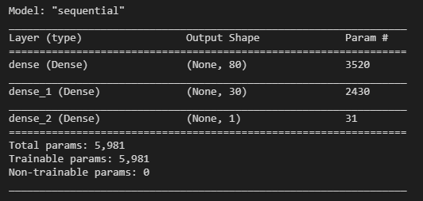
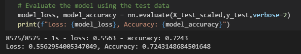
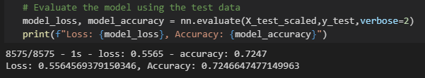
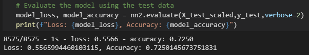
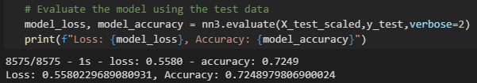

# Neural Network Charity Analysis

## Overview

Alphabet Soup is a philanthropic foundation dedicated to helping the organizations that protect the environment, improve people's well-being, and unify the world. Alphabet Soup has donated billions of dollars to various organizations in last two decades. Beks is a data scientist and programmer, in-charge of data collection and analysis in the entire organization. Her job is to analyze the impact of each donation and vet potential recipients. This helps ensure that foundations money is being spent effectively. 

Alphabet Soup's president, Andy Glad, wants Beks to create a mathematical data driven solution to predict which organizations are worth donating and which are high-risk. Beks has decided this problem too complex for statistics and machine learning models. Therefore, she will design and train a deep learning neural network. It will evaluate all types of input data and produce a clear decision making result. I will help becks in designing and training deep neural network model using Python Tensorflow Library. This will help Alphabet Soup determine which organizations should receive donation.

**Programming Language:** Python 3.7.9

**Libraries Used:** Tensorflow, Sklearn, Pandas

**Softwares Used:** Visual Studio Code, Jupyter Notebook, Anaconda 1.7.2

**Data Source** [charity_data.csv](./Resources/charity_data.csv)  

## Results

### Data Preprocessing

* The purpose of the neural network model is to determine if the money will be used effectively by applicant organization. Therefore, **IS_SUCCESSFUL** variable is chosen as the target variable which shows if the money was used effectively by the recipient organization.

* The variables used as features for the model are **APPLICATION_TYPE** (Alphabet Soup application type), **AFFILIATION** (Affiliated sector of industry), **CLASSIFICATION** (Government organization classification), **USE_CASE** (Use case for funding), **RGANIZATION** (Organization type), **STATUS** (Active status), **INCOME_AMT** (Income classification), **SPECIAL_CONSIDERATIONS** (Special consideration for application), and **ASK_AMT** (Funding amount requested)

* **EIN** and **NAME** were neither used as target nor features as these are just identification columns

* There were seven categorical variables that were encoded using *one-hot encoding*. The numerical values were standardized using the StandardScaler() module

### Compiling, Training, and Evaluating the Model

* Data seems to be complex with number of inputs and having nonlinear characteristics. Therefore for the neural network model, 2 hidden layers were used apart from an output layer. 
* In first hidden layer (or input layer), 80 neurons were used. In second layer, 30 neurons were used. Since the output layer reports classification model value, it contains only 1 neuron.

* In the hidden layers, the **relu** activation function was used to identify nonlinear characteristics from the input values. In the output layer, the **sigmoid** activation function will help us predict the probability if the amount will be used effectively or not.
* I used **adam** optimizer as optimization function and **binary_crossentropy** as loss function. The model is run for 50 epochs.
* The *Accuracy for the model was 0.7243148684501648 (or 72%)*.  However, we were aiming more than 75% accuracy. Therefore, the desired model performance wasn't achieved.

* I took following steps to optimize the model and improve accuracy:

    Attempt 1: I increased the number of bins for APPLICATION_TYPE and CLASSIFICATION columns. Also try dropping the STATUS column as it seemed to be inconsequential. However, there wasn't any change in the accuracy.

    

    Attempt 2: Increased the number of neurons in first layer from 80 to 100, and in second layer from 30 to 50. Also added a third hidden layer with 30 neutrons. However, the accuracy didn't improve much.

    

    Attempt 3: In this attempt, i used "tanh" activation function instead of "relu" activation function. Also, the number of epochs have increased to 100 from 50. Again, there wasn't any change in the accuracy.
    
    

## Summary

The neural network model's accuracy score was 0.7243148684501648 or 72%. This means the model can accurately predict if the organization will use funds effectively about 72 times out of every 100. The results are not bad as this is model is not meant to be used in an industry where very high accuracy is a must (e.g., medical industry). The model falls short of target accuracy of 75% but the difference is not huge. However, better accuracy is always good. The three attemps made to optimize the model and improve the accuracy didn't result in any significant improvement. 

Alternatively, we can use **Random Forest** solve this classification problem. Random Forest models have been widely used in machine learning algorithms due to their robustness and scalability. They can easily handle outliers and nonlinear data, and easy to interpret. Since the Alphabet Soup data is in tabular form, it can be used in Random Forest model. 
